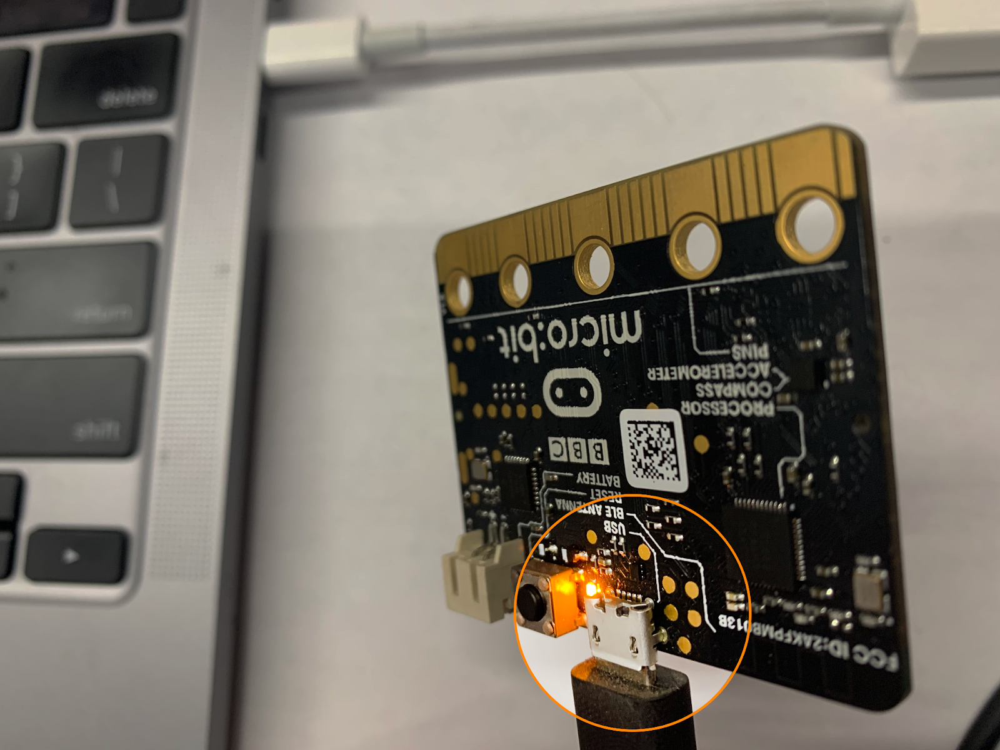

# Setting up the Microbit and MIT App Inventor
Prepare the Microbits to collect data and give your plant a personality.

You can assemble your Microbit and sensor in just a few steps. 

### 1. Setting up the Microbit
* 1. Get the Microbit Code. 
The Microbit needs code to activate sensors and send data to student apps.
 Go to:  https://makecode.microbit.org/S97971-17452-78128-79842
 * Click the button Edit Code in the top right corner:

 
 * You should see the following page:

 
 * Decide whether you should log into Microbit.org (top right). If you do not log in, the code will always be saved on the computer you are using. If you log in, the code will be saved to an online account you can use on any computer. 

 * Briefly check out the Microbit code used for this lesson. This code will collect temperature, humidity, and moisture data with the external sensor. The Microbit will send data to the phone app every 2 seconds over Bluetooth.  

 * 2. Connect the Microbit to the USB cable
Connect the Microbit and your computer to the black USB cable with the device (or use any typical Micro-USB cable you have available). 

* The Microbit should light up!

* 3. Download the code to the Microbit
* Click on the three dots as shown.

* Choose Connect Device and follow the directions on the screen to connect the Microbit to the computer. (The Microbit will automatically connect to this computer from now on.)

* Click Download. 

You may see a computer notification, “Disk not ejected properly!” You can safely ignore this warning.
Troubleshooting: If the Microbit does not download, follow the instructions provided on your screen or the tips in Appendix B. Don’t worry — the solution is not complicated! 

* After about a minute, you should see a graphic of a little sleeping guy on the LED display. Success! 

 
* From now on, this microbit will always hold onto your new code, even when unplugged. 

### 2. Setting up MIT App Inventor

* Get App Inventor Companion for testing apps
* Install the MIT App Inventor Companion app for your Android device or Chromebook. 
* Search MIT AI2 Companion on Google Play. 
* Click Install and Open.

* If your device already has MIT AI2 Companion, check for the latest version: 2.70 or higher 

* If Companion is not up to date, use the Play Store or the App Inventor site for updates. 

* On your computer, get the app starter code for the lesson
* There are two ways to load the app automatically:
* * For Google email users, click this link: https://ai2.appinventor.mit.edu/?locale=en&repo=http://appinventor.mit.edu/yrtoolkit/yr/aiaFiles/DataScience/planttest.asc

* This method is preferred because students can save their apps to their  Gmail accounts.
Students can also log in anonymously using the Code.appinventor.mit.edu site.

* After logging in, the starter app should appear on the screen: 

* Please wait up to a minute for the app to reach your browser.
* Try the above link one more time if the file does not appear after login. 
 

* 3. Run the starter app on the phone, tablet, or Chromebook  
* From the Connect menu, select AI Companion.

* If using a Chromebook to code apps, select the Chromebook option in the Connect menu.  

* Scan the QR code that appears using the MIT AI2 Companion app on your mobile device: 

* After a few seconds, the app should appear on your mobile device or Chromebook: 

* Check that Bluetooth is on.
Check your phone or tablet settings to ensure that Bluetooth is on. 
Do not pair the Microbits at this time. You will connect devices in “no pair” mode next.  

### 3. Set up the Sensor and Start Logging Data

* 1. Connect the app and Microbit through Bluetooth. Plug the Microbit into a power source such as your USB cord or a battery pack. 

* 2. Connect the Microbit to the plant sensor using the alligator clips. 
- Connect a black clip to ground (marked “GND”) on both devices
- Connect a red clip to 3 volts (“3V”) on both devices
- Choose two other colors for the other connections. 
- Connect the alligator clips so they are sticking out, as shown. (Otherwise, they might slip to the side and touch another contact on the Microbit or sensor.)

* 3. Click Scan for Nearby Devices on the app to search for nearby Bluetooth devices. 
- Click yes to any permission screens that appear. 
 

 * 4. Look for the Bluetooth device with “BBC Micro:bit” in the name. 
- When you see the Microbit listed, press Stop Scan. 
- Write down the Microbit’s unique ID number and save it for later. It will be a name like “votep” or “zeteg”.
- Notice, for a moment, all the other Bluetooth devices in your vicinity. Many are small sensors in appliances and equipment all over the school. 

* 5. Click on your Microbit. A Connect button will appear on the screen. Click Connect. 

* 6. Your Microbit will be connected!	
- The microbit display should show the little monster.

- The app should be collecting temperature, humidity, and moisture.  

- Click on the picture of your cyborg plant to hear how it is feeling.  
