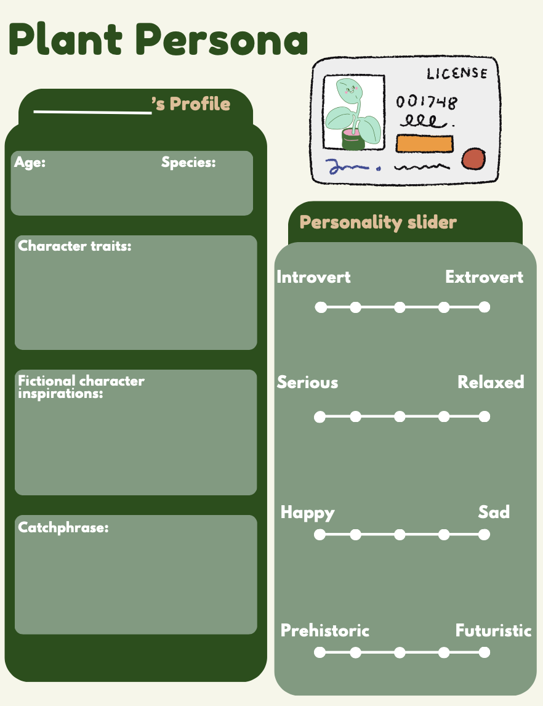

# What is Sociable Technology?
- Inherently, humans are social beings that tend to apply social thinking to things we do not understand. We may give inanimate objects an emotional background such as detecting faces and different shapes that aren't really there as an interpretation from our imagination, this could be seeing a face in a doorknob or telling stories about different shapes we see in the clouds and such... 
- Therefore, social robots are more appealing and helpful to use in the long term. For that reason, we apply social aspects to our plant app in order to create a more useable and sustainable interface for long term use! 

# Designing Social Robots 
- Many different things go into designing social robots, such as:
- - Speech
- - Consistent personality
- - Behavior 
- - Memory
- - Emotion
- - Responsiveness

# Crafting The Plant's Persona 
- To give your plant a unique persona, use this activity sheet and be as creative as you can be! 

- Once you're done, try to put the information you came up with into sentences and add these prompts into your blocks of code on App Inventor. This process would be called "Prompt Engineering"

