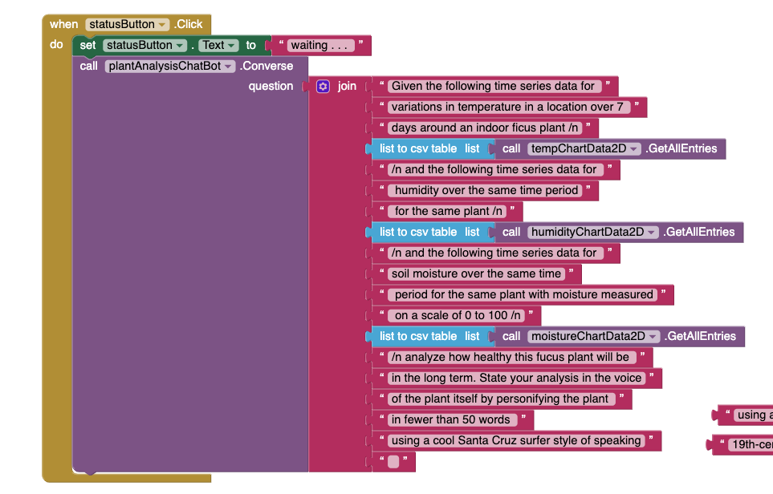
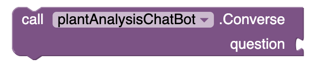
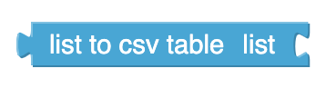
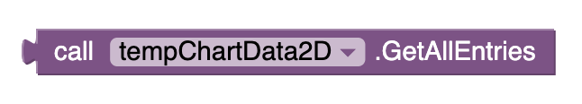
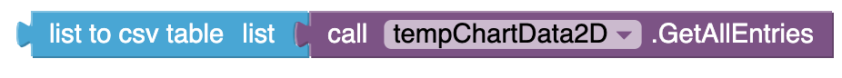

# Resources
- Click [here] for access to the workshop slides
- Click [here] to view the workshop's teachers guide

# # Breakdown of the main blocks of code:

- This block of code will begin executing once the status button is clicked: 

- Let's break it down further:

- This block asks a question of the Chat Bot. Successive calls will remember information from earlier in the conversation. 
- “Join” combines the list of questions together so that the chatbot can read it as one paragraph. The sentences in the pink blocks are prompts and the green block calls on the input that the students put in the text box before clicking the button

- This block interprets the list as a table in row-major format and returns a CSV (comma-separated value) text representing the table. Each item in the list should itself be a list representing a row of the CSV table. Each item in the row list is considered to be a field, and is quoted with double-quotes in the resulting CSV text. In the returned text, items in rows are separated by commas and rows are separated by CRLF

- For this block, If the command text box has text and is not not empty, then execute the next lines of code. 

- This calls on the temperature data that was initialized into a list in the setup of this app. All other datasets can be called on this same way, by changing the tempChartData2D.  

