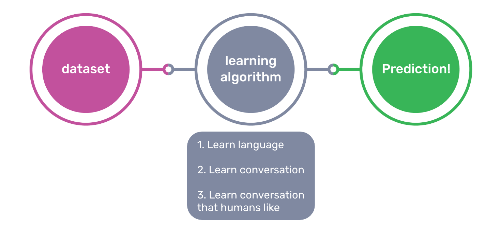

# What is ChatGPT?
- Most people have spoken with a chatbot at least once in their lives. Chatbots are all around us, such as Amazon's Alexa, Apple's Siri, or even a textbox on your computer screen. 
- ChatGPT is a Chatbot (hence the name “Chat”) which is a computer program that uses artificial intelligence to conduct an online conversation
- ChatGPT uses the large language model, currently GPT-4 which is why it is called “ChatGPT”

# What is a Large Language Model? 
- Chatbots like ChatGPT use a large language model to generate humanlike dialogue 
- A large language model is a computer program that learns to predict which words usually follow which. For example, let’s say a large language model is given a sentence “Once upon a ___". The word it would learn is most likely to follow next is “time”.

# How was ChatGPT made?

- This is a diagram of the machine learning process. We start with a dataset. We then feed that dataset to a learning algorithm which finds patterns in the data it sees. Finally, the patterns are encoded in a “model”, which makes predictions about new data it sees that’s outside its original dataset.

# Dataset
- ChatGPT is fed chunks words, paragraphs and sentences from BILLIONS of sources on the internet:
- - articles, magazines, scientific papers,
- - Twitter
- - Wikipedia
- - Blogs. 

- It learns to create new sentences and paragraphs from all these examples of language online.

